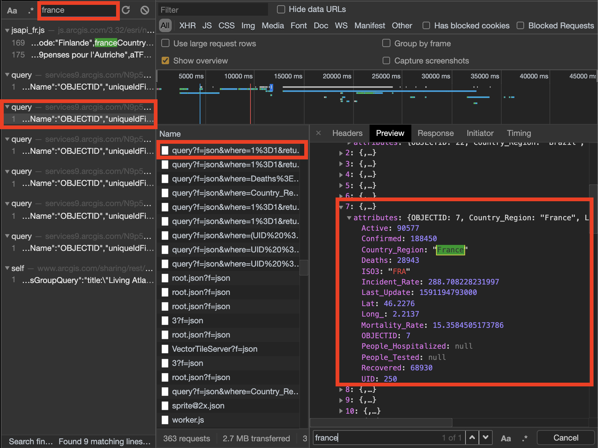

## Motivation:

> Seriously, have you made another coronavirus tracker?

Hold on, let’s back a little in February 2020. As a 3rd-year student in college, I was preparing a 4th international year (in Australia). With the growth of the pandemic in China, some of my friends were forbidden to select « China » for the 4th year destination. So, we often check the official coronavirus website tracker to keep in touch with the evolution of our selected country and verify its openness.

I often used the official tracker on my mobile phone. However, this one wasn’t very responsive and the UX was awful. Then, I got the idea: make my coronavirus app tracker with the possibility to be notified for some selected countries.

## What do I need to build that app?

1. [React-Native](https://reactnative.dev/):

   As I wish to share my app with my friends, I decide to use react-native which allows cross-platform development.

2. [Firebase](https://firebase.google.com/):

   I wasn’t too familiar with this technology, but it seemed to be a timesaver for a small app like mine.

## Starting from the basics...

To begin with, we need to get the freshest data. How?

1. Get data from the [official github repository](https://github.com/CSSEGISandData/COVID-19).

   But this repository is refreshed only once a day 😢.

2. Get data from the API used by the [official coronavirus tracker](https://www.arcgis.com/apps/opsdashboard/index.html#/bda7594740fd40299423467b48e9ecf6).

   This one is updated several times a day (better 😏).

As you guess, we will use the 2nd option.

## Do we **really** need a backend if an API already exists?

_The answer is **yes**._

1. How can we notify some users about country updates if we don’t know the country data?
2. How can we know which user subscribe to which country if there is no storage location?
3. What if the used API changes their data schema and my application only use this endpoint? 💣

These points are the main reasons of what we need a backend.

## Let’s build that backend! [(source code)](https://github.com/lucasmrdt/coronavirus-tracker-backend)

### Aggregate data [(main section)](https://github.com/lucasmrdt/coronavirus-tracker-backend/blob/6c147b028ce6730abf25433499c0a03d6ec71a54/functions/src/Country/country.api.ts#L40)

First, as I said previously, we'll use the endpoint used by [official coronavirus tracker](https://www.arcgis.com/apps/opsdashboard/index.html#/bda7594740fd40299423467b48e9ecf6) to get live data. To do so, let's begin with inspecting her website.

By toggling "Inspector view" in chrome, we can now see all API requests made by the website. In a few steps, we can easily found how the significant data is fetched.



Therefore, we got the endpoint URL:

```bash
https://services1.arcgis.com/0MSEUqKaxRlEPj5g/arcgis/rest/services/ncov_cases/FeatureServer/1/query?f=json&where=Confirmed%20%3E%200&returnGeometry=false&spatialRel=esriSpatialRelIntersects&outFields=*&orderByFields=Confirmed%20desc%2CCountry_Region%20asc%2CProvince_State%20asc&resultOffset=0&resultRecordCount=250&cacheHint=true
```

And the schema:

```json
{
  "features": [
    {
      "attributes": {
        "Active": 1315700,
        "Confirmed": 1834243,
        "Country_Region": "US",
        "Deaths": 106274,
        "Lat": 40,
        "Long_": -100,
        "Recovered": 463868
        // ...
      }
    }
    // ...
  ]
  // ...
}
```

This is all we need!

Implementations:

- [Fetch countries from this API](https://github.com/lucasmrdt/coronavirus-tracker-backend/blob/6c147b028ce6730abf25433499c0a03d6ec71a54/functions/src/Country/country.api.ts#L40)
- [Firebase function which will fetch and save countries](https://github.com/lucasmrdt/coronavirus-tracker-backend/blob/master/functions/src/Country/country.functions.ts#L39https://github.com/lucasmrdt/coronavirus-tracker-backend/blob/master/functions/src/Country/country.functions.ts#L39)

### Add some scheduled tasks to keep our database updated [(main section)](https://github.com/lucasmrdt/coronavirus-tracker-backend/blob/master/functions/src/Country/country.functions.ts#L86)

Now, we can easily scrap our data but it'll be better if someone will update our data itself. Lets introduce you: `functions.pubsub.schedule`.

This function allows you to schedule as a [cron task](https://en.wikipedia.org/wiki/Cron) some function call. So we simply call our function `refreshCountries`. [(Implementation here)](https://github.com/lucasmrdt/coronavirus-tracker-backend/blob/master/functions/src/Country/country.functions.ts#L86)

### Notification service implementation

We want to be notified when new data is ...

**🚧 WIP**

## ✍🏻 Something wrong or a suggestion? Suggest a change [here](https://github.com/lucasmrdt/personal-blog/blob/master/content/posts/2020-06-03-coronavirus/index.md)
