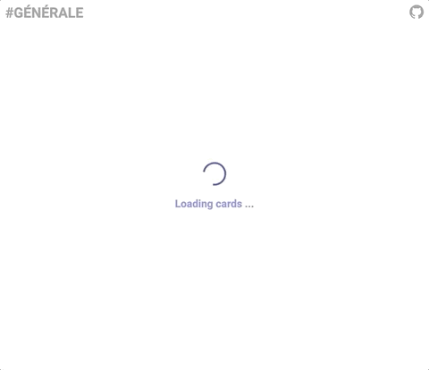
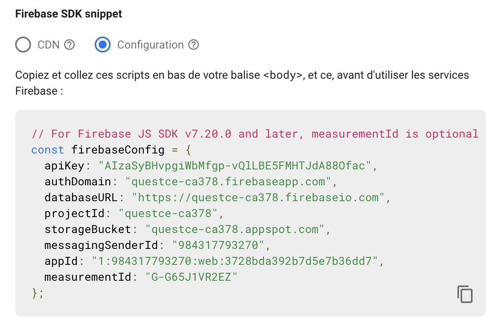

# ⚠️ This is not an article, it's a project overview ([source code](https://github.com/lucasmrdt/questce-le-quizz)) 🔎

---



#  QuEstCe le Quizz

> Quickly generate memory flashcards to better learn and review knowledge.

 

---

## 📢 Test It Now

1.  Go to the [demo here](https://quiz.lucas-marandat.fr/?id=demo).
2.  Then enjoy !

## 🚀 Installation

1. Fork the project
2. Clone it
3. Install dependencies `npm install`
4. Start the project `npm start`

## 🎨 Customize

### 1️⃣ Create a firebase project

Create a firebase project with a **web application** and a **realtime database** (if you don't how follow [the official steps](firebase.google.com))

### 2️⃣ Link the local firebase config to your firebase app

On the **setting** of your firebase **web application** copy and past your **firebase config** into [static/config.js](./static/config.js) file



### 3️⃣ Create your content

**Edit** the [static/database.json](./static/database.json) file and respect the data structure explained bellow

### 4️⃣ Upload your database

**Upload** your data to your **realtime database**


### 5️⃣ The enjoy !

- Run `npm start`
- Go to [http://localhost:3000/?id=demo](http://localhost:3000/?id=demo) (`id=...` refers to the name of the key you've given to your topic in [static/database.json](./static/database.json), note that if you don't provide any id all topics will be fetched)

```bash
git clone https://github.com/lucasmrdt/edt-to-google-calendar
cd edt-to-google-calendar
pip install -r requirements.txt --user
```

## 🏗 Database structure

> See [static/database.json](./static/database.json)

|             key             |         type          |
| :-------------------------: | :-------------------: |
| topic name _(eg. `"demo"`)_ | List<[ICard](#icard)> |

### ICard

| key           | required | type     | example         | description                                                                                                      |
| ------------- | -------- | -------- | --------------- | ---------------------------------------------------------------------------------------------------------------- |
| question      | ✅       | `string` | `"my question"` | Enter your question here,<br/>past some url picture to embed<br/>a picture<br/>and write latex with `$x = \\pi$` |
| answer        | ✅       | `string` | `"my answer"`   | Enter your answer here,<br/>past some url picture to embed<br/>a picture<br/>and write latex with `$x = \\pi$`   |
| un_reversible | ❌       | `bool`   | `false`         | Set to `true` if your question is<br/>a one way question                                                         |

---

## 💌 Contributing

Fell free to enhance the project by adding some new / more customable features.

---

## ✍🏻 Something wrong or a suggestion? Suggest a change [here](https://github.com/lucasmrdt/personal-blog/blob/master/content/posts/2020-05-12-Algorithms/index.md)
